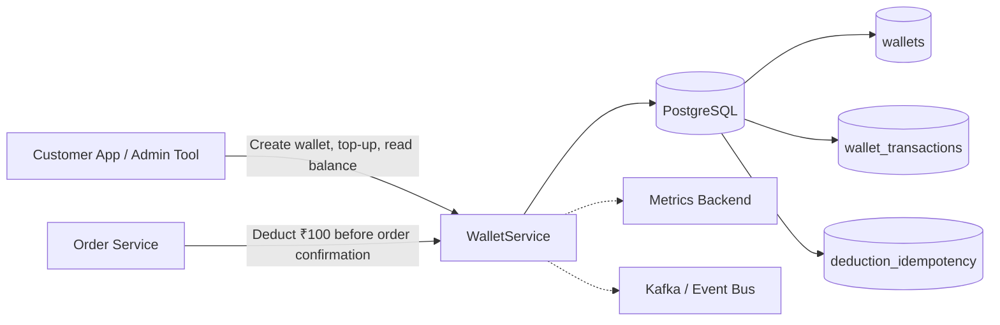
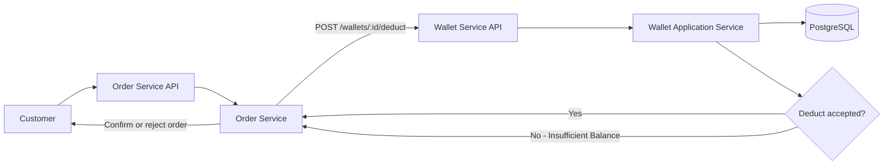
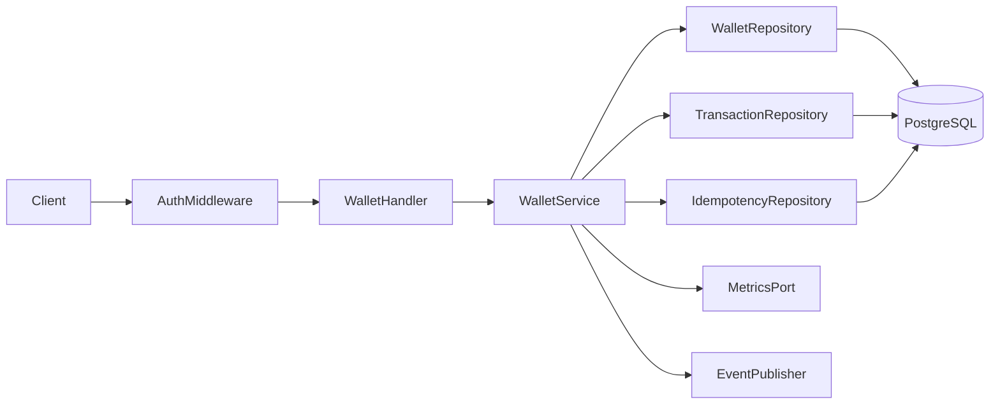
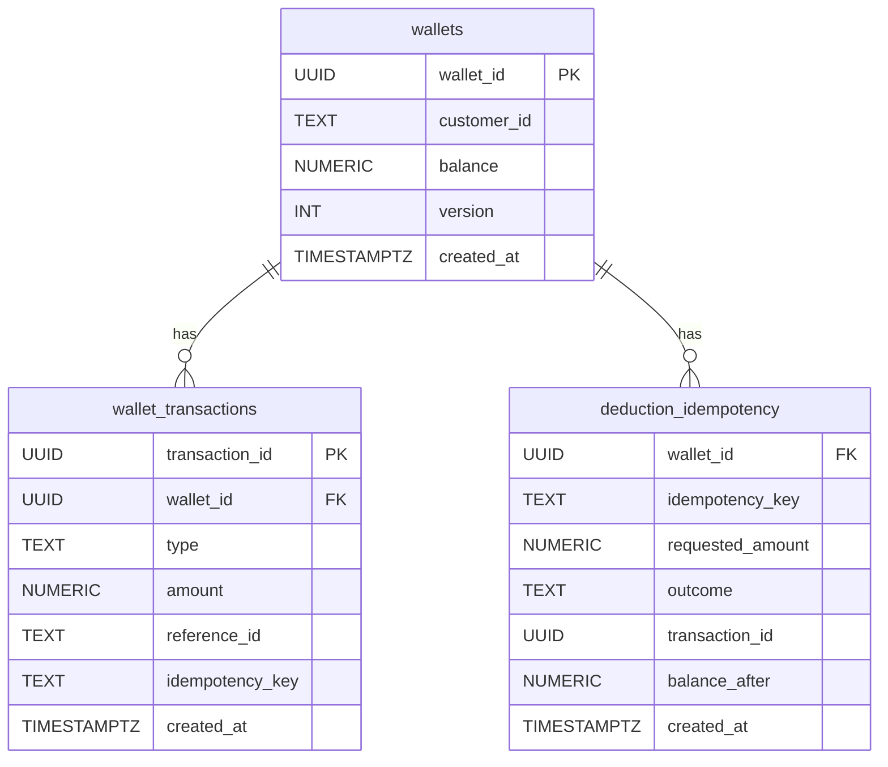
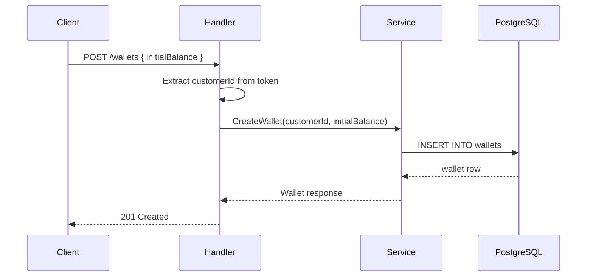
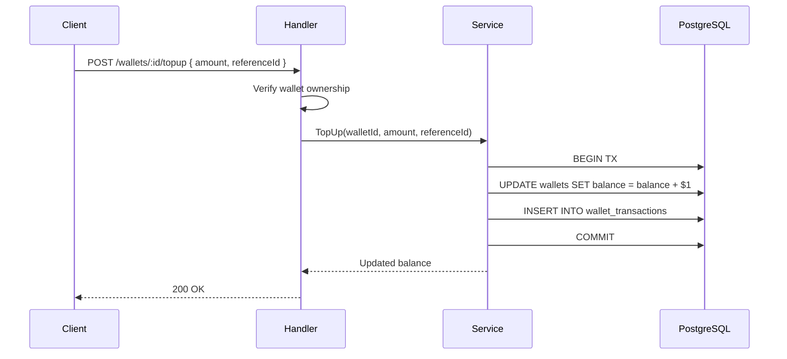
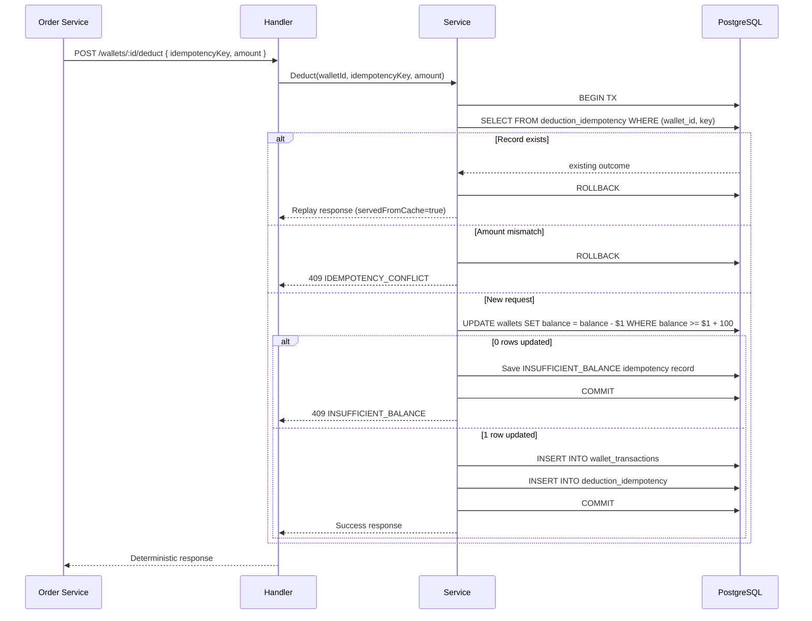
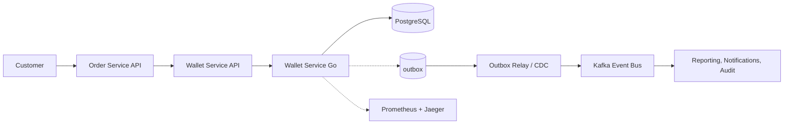

# Wallet Service — High-Level Design (Go + PostgreSQL)

## 1. Objective

Build a Wallet Service for a logistics platform that:

- Owns customer balances; a wallet must maintain a **minimum reserve of ₹100** and never drop below it.
- Records every money movement in an **immutable ledger**.
- Makes every `deduct` call from `Order Service` **idempotent**.

The service is written in **Go**, persists state in **PostgreSQL**, and exposes an **HTTP/JSON** API via the **Gin** framework.

---

## 2. Scope

**In scope:**
- Wallet creation (minimum ₹100 initial balance)
- Wallet top-up
- Order-value deduction (idempotent, atomic, maintains ₹100 reserve)
- Balance lookup
- Transaction history lookup (reverse chronological order)
- Lightweight static-token authentication and authorization
- Metrics and event publishing extension points (no-op defaults)
- Manual DB schema setup via `scripts/setup_db.sql`

**Out of scope:**
- Full IAM / JWT / mTLS
- Real Kafka integration
- Pagination and search APIs
- Multi-region / distributed coordination
- Full tenant management

---

## 3. System Context



### 3.1 Order Placement Flow



The wallet service returns a **deterministic response** on every call — retries with the same `idempotencyKey` are safe and do not double-charge.

---

## 4. API Endpoints

| Method | Path | Caller | Purpose |
|--------|------|--------|---------|
| `POST` | `/wallets` | Customer | Create a new wallet |
| `GET` | `/wallets/:id` | Customer / Order Service | Get wallet details |
| `POST` | `/wallets/:id/topup` | Customer | Add funds |
| `POST` | `/wallets/:id/deduct` | Order Service | Deduct ₹100 (idempotent) |
| `GET` | `/wallets/:id/balance` | Anyone | Return current balance |
| `GET` | `/wallets/:id/transactions` | Anyone | Return ledger entries |
| `GET` | `/health` | Infrastructure | Health check |

---

## 5. Functional Requirements

- `topup` increases balance by a positive amount.
- `deduct` uses the amount supplied by the trusted `Order Service`.
- `deduct` succeeds only if `balance >= amount`; wallet must never go negative.
- Repeated `deduct` with the same `(walletId, idempotencyKey)` returns the same logical result.
- A `deduct` retry with a **different amount** for the same idempotency key is rejected as a conflict.
- Wallet state and ledger must remain consistent (single DB transaction per mutation).

---

## 6. Non-Functional Goals

- **Correctness first** — no negative balances, no double charges.
- **Atomicity** — balance update + ledger write + idempotency record in one DB transaction.
- **Local developer usability** — `docker run postgres` + `go run ./cmd/server`.
- **Clean separation of concerns** — handler / service / repository layers.
- **Observable** — structured logging, health endpoint, metrics and event hooks.

---

## 7. Architectural Style

Layered architecture with dependency inversion (ports and adapters):

```
HTTP Request
    ↓
Auth Middleware (CallerContext injection)
    ↓
Handler Layer  (Gin, request/response mapping)
    ↓
Service Layer  (business rules, orchestration)
    ↓
Repository Interfaces (ports)
    ↓
PostgreSQL Adapters (pgx-backed implementations)
    ↓
PostgreSQL
```



---

## 8. Core Design Decisions

### 8.1 Minimum Balance Reserve (Configurable)
The minimum balance reserve is configurable via `resources/config.yaml`:
```yaml
business:
  minimum_balance_reserve: 100.0
```
Enforced at two levels:
- **Business logic**: `CreateWallet` rejects `initialBalance < minReserve`
- **Debit SQL**: `WHERE balance >= $1 + $3` where `$3` is the configured reserve — atomic, race-condition-free

The DB only has `CHECK (balance >= 0)` as an absolute safety net. The business reserve is intentionally kept at the application layer so it can be changed via config without a DB migration.

### 8.2 Atomic Conditional Balance Update
Instead of read-then-write (which is race-prone), the debit path uses:

```sql
UPDATE wallets
SET balance = balance - $1, version = version + 1
WHERE wallet_id = $2 AND balance >= $1::numeric + $3::numeric
RETURNING balance
```

- `$1` = deduction amount, `$2` = wallet ID, `$3` = configured minimum reserve.
- Explicit `::numeric` casts required by pgx v5 to avoid PostgreSQL operator ambiguity with multiple untyped parameters.
- If 1 row updated → debit succeeded, reserve maintained.
- If 0 rows updated → insufficient balance (after reserve) or wallet missing.
- The entire deduction (balance update + ledger row + idempotency row) runs inside **one DB transaction**.

### 8.3 Idempotent Deduction
The `deduction_idempotency` table has a `PRIMARY KEY (wallet_id, idempotency_key)` constraint.

Flow:
1. Check if idempotency record exists → return stored outcome (replay).
2. If amount differs → reject as `IDEMPOTENCY_CONFLICT`.
3. If new → run atomic debit, persist record in same transaction.
4. **Even failures are stored** (e.g., `INSUFFICIENT_BALANCE` outcome) to ensure consistent replay.

### 8.4 Transaction History Ordering
`GET /wallets/:id/transactions` returns entries in **reverse chronological order** (newest first) via `ORDER BY created_at DESC`.

### 8.5 Ledger as Source of Truth for Audit
Every top-up and deduction appends a row to `wallet_transactions`. The `balance` column on `wallets` is a fast-read cache. On conflict these two sources should always agree (enforced by same-transaction writes).

### 8.6 Static Token Auth
- `customer:<customerId>` → role `CUSTOMER`, identity extracted from token.
- `order-service-secret` (from config file) → role `ORDER_SERVICE`.
- `POST /wallets` derives `customerId` from token (not request body).
- Customer operations enforce wallet ownership.

### 8.7 No-Op Metrics and Events
`MetricsPort` and `EventPublisher` are interfaces with no-op defaults. Easily replaced with Prometheus / Kafka in production without touching business logic.

---

## 9. Data Model Overview

### Tables

| Table | Purpose |
|-------|---------|
| `wallets` | Owns balance and customer mapping |
| `wallet_transactions` | Immutable ledger of every money movement |
| `deduction_idempotency` | Stores deduction outcomes, keyed by `(wallet_id, idempotency_key)` |

### Entity Relationships



---

## 10. Request Flows

### 10.1 Create Wallet



### 10.2 Top-Up



### 10.3 Deduct (Idempotent)



---

## 11. Business Rules

- **Single currency**: All amounts in INR (₹)
- **One wallet per customer**: Enforced by `UNIQUE INDEX` on `customer_id`
- **Minimum balance reserve**: ₹100 — balance can never drop below this threshold
- **Idempotency**: Only `/deduct` endpoint requires idempotency key
- **Transaction history**: Returned in reverse chronological order (newest first)

---

## 12. Failure Handling

| Scenario | HTTP Status | Error Code |
|----------|-------------|------------|
| Validation failure (e.g., amount ≤ 0, initialBalance < 100) | 400 | `INVALID_REQUEST` |
| Missing / bad token | 401 | `UNAUTHORIZED` |
| Wrong role / wrong owner | 403 | `FORBIDDEN` |
| Wallet not found | 404 | `WALLET_NOT_FOUND` |
| Insufficient balance (including ₹100 reserve) | 409 | `INSUFFICIENT_BALANCE` |
| Idempotency key conflict | 409 | `IDEMPOTENCY_CONFLICT` |
| Duplicate wallet | 409 | `DUPLICATE_WALLET` |
| Unexpected error | 500 | `INTERNAL_ERROR` |

---

## 13. Scaling and Evolution Path

### Current State
- Single Go process, PostgreSQL backend.
- Per-request DB transactions enforce correctness.
- No distributed coordination needed.
- Configuration via YAML file (`resources/config.yaml`) including configurable minimum balance reserve.
- Manual DB schema setup via `scripts/setup_db.sql` (works with Docker or Postgres.app on macOS).

### Next Steps
- Add pagination to `GET /wallets/:id/transactions`.
- Replace no-op `EventPublisher` with Kafka + transactional outbox.
- Replace static token auth with JWT / mTLS.
- Add Prometheus metrics via `MetricsPort`.
- Add Redis for idempotency hot-path caching.
- Integration tests with `testcontainers-go`.
- Concurrency tests (20 goroutines, assert balance constraints hold).

### Production Deployment View



---

## 14. Observability and Operational Hooks

**MetricsPort** (interface, no-op default):
- `RecordCreateWallet()`
- `RecordTopupSuccess()`
- `RecordDeductSuccess()`
- `RecordDeductRejected()`
- `RecordIdempotentReplay()`
- `RecordLatency(operation string, duration time.Duration)`

**EventPublisher** (interface, no-op default):
- `PublishWalletCreated(walletId, customerId string)`
- `PublishWalletToppedUp(walletId string, amount float64)`
- `PublishWalletDeducted(walletId string, amount float64, txnId string)`
- `PublishWalletDeductionRejected(walletId, reason string)`

**Health check**: `GET /health` → `200 OK` with DB ping.

---

## 15. Trade-offs

| Decision | Trade-off |
|----------|-----------|
| `balance` column on `wallets` | Fast reads; duplicates data derivable from ledger. Kept consistent by same-transaction writes. |
| Atomic conditional UPDATE for debit | Best concurrency and correctness; avoids SELECT + UPDATE race. Slightly less readable than ORM. |
| Static bearer tokens | Simple to run locally and demonstrate auth thinking; not production-grade security. |
| Manual DB setup via script | Requires one-time `psql` command; avoids migration tooling complexity. For production, automate via CI/CD. |
| No-op metrics/events | Keeps service runnable without external dependencies; production readiness is an interface swap. |
| ₹100 minimum reserve | Enforces business rule; prevents wallet exhaustion. Configurable via `business.minimum_balance_reserve` in `config.yaml` — no DB migration required. |
| Config from YAML file | Easier local development; for production, use env vars or secret managers. |
| pgx v5 ENUM casts | `$2::money_movement_type` and `$4::deduction_outcome` explicit casts required because pgx v5 does not auto-register custom PostgreSQL ENUM types. |
